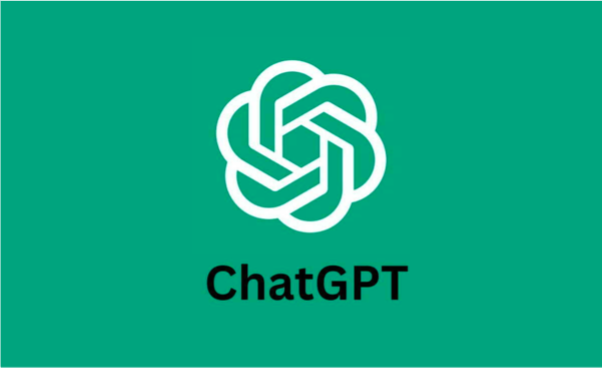

+++
title = "Reportage "
date = "2024-06-11"
draft = false
pinned = false
+++
Im Klassenzimmer ist es laut, die Lehrkraft ist nicht da und niemand arbeitet an seinen Aufgaben. Plötzlich erhält die Klasse eine E-Mail. Wir lesen die Nachricht und sehen, dass die Lehrkraft uns einen Auftrag erteilt, den wir bis am Abend abgeben müssen. Wir müssen einen halbstündigen Film schauen und dazu einige Fragen beantworten. Ohne grosse Motivation, machen wir uns an die Arbeit und starten den Film. Schnell stellen wir fest, dass der Film sehr langweilig ist und wir diesen nicht fertig schauen wollen. Da schlägt mein Kollege vor, Chat GPT, eine künstliche Intelligenz (KI) zu verwenden. Mit deren Hilfe erledigen wir den Auftrag in nur 10 Minuten.

Vorgespult zur nächsten Lektion dieses Faches: In der Klasse besprechen wir den Film und suchen antworten zu den Fragen. Ich und mein Kollege fühlen uns noch gut, da wir den Auftrag erfüllt haben. Während der Diskussion bemerken wir allerdings, dass wir die Erklärungen der Lehrkraft nicht verstehen. Uns wird klar, dass wir wegen ChatGPT das Thema gar nicht kennen.

***Was ist KI?***

KI (Künstliche Intelligenz) ist eine Art Roboter, welche von Menschen programmiert wurde und sich anhand von grossen Datenmengen weiterentwickeln kann. Dieser Roboter kann Informationen verarbeiten und interpretieren, Gespräche führen und Antworten geben wie ein Mensch. Es gibt viele verschiedene Arten von KI. Es gibt solche, die einen Text generieren, solche die alle Fragen beantworten, solche die ein Bild generieren… Die meisten Leute werden KI mit ChatGPT in Verbindung bringen. Das liegt daran, dass ChatGPT im letzten Jahr grosse Fortschritte gemacht hat und sehr populär geworden ist. ChatGPT ist eine Chatbot, mit dem man kommunizieren kann. Man kann ganze Texte schreiben lassen, allgemeine Fragen stellen und viel mehr. 

Ist es eine gute Idee, eine künstliche Intelligenz für Hausaufgaben oder zum Lernen zu verwenden?
Die Verlockung, eine KI für Haus–aufgaben zu verwenden ist gross, doch erfüllt das immer noch den Sinn der Hausaufgaben?

"Die Verantwortung liegt bei den Schüler und Schülerinnen. Sie müssen selbst wissen, für welche Aufträge es sinnvoll ist KI zu verwenden."
ZURSCHMITTEN CHRISTOFF, WISSENSCHAFTLICHER MITARBEITER PH - BERN

Hausaufgaben:
Da KI in der Zukunft immer besser und somit auch hilfreicher wird, sollten sich auch die Hausaufgaben ändern. Es sollten Aufträge erteilt werden, bei denen komplett auf KI verzichtet werden muss und solche, bei denen man eine KI verwenden kann oder sogar muss. Die Aufgaben, bei denen der Einsatz von KI erlaubt ist, müssen sich aber ändern. Die Schüler sollte zum Beispiel lernen Antworten der KI zu Interpretieren und diese mit Antworten von andern Chatbots zu vergleichen.

Lernen:
Auch beim Lernen stellt sich die Frage, ob man eine KI benutzen will. 

"KI zum Lernen zu verwenden ist eine schöne Möglichkeit, es bietet eine grosse Interaktion."
Christian Matt, Prof. und Co-Direktor des Instituts für Wirtschaftsinformatik an der Uni Bern

Allerdings muss auch beim Lernen die KI mit Sorgfalt genutzt werden. Es besteht immer die Gefahr, dass Fehlinformationen geliefert werden. Aus diesem Grund muss man die Antworten immer kritisch beurteilen und auch andere Quellen nutzen. 

Wird die KI eine Veränderung in der Schule herbeiführen?
In Zukunft wird sich jedenfalls eine Veränderung der Schule abzeichnen. Diese wird die Prüfungen, die Rolle der Lehrkräfte und den Unterricht betreffen.

Prüfungen:
In Zukunft sollte es mehr open book oder sogar open Internet-Prüfungen geben, da man im Berufsleben meist Zugriff auf diese Hilfsmittel hat. Zudem sollte es auch mehr mündliche Prüfungen geben. Prüfungen mit reiner Wissensabfragen sollten immer noch stattfinden, allerdings nicht mehr so häufig wie heute.

Lehrkräfte:
Die Rolle der Lehrkräfte wird sich in Zukunft ändern. Diese müssen den Schülern den Umgang mit der KI erklären und sie auf potenzielle Gefahren hinweisen. Zudem können sie KI auch zum Schreiben oder Korrigieren von Prüfungen oder Aufträgen verwenden. Auch für die Unterrichtsvorbereitung besteht die Möglichkeit eine KI zu verwenden.

Unterricht:
Der Unterricht muss angepasst werden, um mehr mit KI zu interagieren.
In Zukunft müssen die Lehrkräfte die Schüler über die Verwendung von KI aufklären und ihnen zeigen, wie man gut mit ihr zusammenarbeiten kann. Zudem müssen die Lehrkräfte den Schülern auch beibringen KI generierte Texte, Bilder, Musik und vieles mehr zu erkennen und von menschlich gemachten zu Unterscheiden.
Soll KI an Schulen verboten werden?
Es stellt sich immer wieder die Frage, ob KI an Schulen eingeschränkt oder gänzlich verboten werden soll.

"Das Verbannen von KI an Schulen ist keine Möglichkeit, denn man braucht sie später für den Beruf."
Christian Matt, Prof. und Co-Direktor des Instituts für Wirtschaftsinformatik an der Uni Bern

Man muss sich im Klaren seine, dass sich ähnliche Veränderungen auch schon in der Vergangenheit zugetragen haben. Als Taschenrechner erfunden wurden, hat sicherlich die gleiche Diskussion stattgefunden wie heute mit der KI. Es wurde befürchtet das Schüler das Rechnen verlernen würden. Auch bei Text-verarbeitungsprogrammen wie Word hat sich diese Diskussion abgespielt. Dort wurde befürchtet, dass Schüler schlechtere Rechtschreibung haben werden. Wie man heute erkennt, haben sich diese Befürchtungen nicht bewahrheitet. Rechner und Textverarbeitungsprogramme dienen Heute als Hilfsmittel und werden täglich gebraucht, ohne den Schülern zu schaden. Das gleiche wird mit der KI passieren. In Zukunft wird die Verwendung von KI auch zum Alltag gehören.
Die Verwendung von neuen Mitteln im Unterricht ist also ein kontinuierlicher Prozess. In letzter Zeit war es das Internet, das Übersetzen von Texten durch DeepL und jetzt das Generieren von Texten mit ChatGPT.

Da sich die Verbannung von KI an Schulen dementsprechend nicht rechtfertigt, sollte man in der Schule lernen, wie man richtig mit KI umgeht und mit ihr zusammenar-beitet. So kann man Erfahrungen sam¬meln, die dann im Berufsleben sehr wertvoll sind und einem einen Vorteil gegenüber anderen ermöglichen.

An der Pädagogischen Hochschule in Bern wird momentan viel über KI geforscht. Christoff Zurschmitten ist ein Mitarbeiter an dieser Hochschule und hat uns ein wenig hinter die Kulissen blicken lassen. Sie seien sich gerade am Antasten und es werden Fragen wie, «wie funktioniert die KI?», «was bringt die KI?», etc. gestellt. Herr Zurschmitten kennt sich bereits gut mit der Bildgenerierung aus, da er diese Art von KI schon vor dem grossen “KI hype” benutzt hat. Nun ist KI für ihn ein riesiger Bereich. Früher habe er als Lehrer gearbeitet und da war die KI noch kein Thema. Er selbst verwende im Alltag KI, jedoch ist er vorsichtig mit der Verwendung. Er möchte nicht, dass KI den ganzen Auftrag für ihn macht, sondern möchte KI lieber als Partner sehen. Wenn man mit der KI arbeiten würde und nicht die KI für sich arbeiten lässt, kann man viel profitieren. 

***Christian Matt:***

Auch an der Universität Bern wird momentan viel über KI geforscht. Dort hat uns Herr Christian Matt einen Einblick in seine Arbeit gewährt. Herr Matt arbeitet am Institut für Wirtschaftsinformatik als Co-Direktor. Auch dort ist KI ein neues Thema. Er sieht ein grosses Potenzial in diesem Bereich und bemerkt, dass in den letzten Jahren ein riesiger Fortschritt gemacht werden konnte. Er meint auch, dass KI mit Chat GPT in der Öffentlichkeit angekommen ist. Generell findet er KI eine sehr gute Entwicklung, man muss allerdings vorsichtig bei der Nutzung sein.

***Laurent Stettbacher:***

Wir haben ebenfalls mit einem Schüler ein Interview durchgeführt. Laurent Stettbacher besucht momentan die WMB (Wirtschaftliche Mittelschule Bern). Er meinte, es wäre wichtig, sorgfältig mit einer KI umzugehen, da es Nachteile haben kann. Man könne mit der KI vielleicht einen Text schreiben lassen, jedoch wisse man nicht zu 100%, ob die Informationen der Wahrheit entsprechen. Er hat selbst eine solche Erfahrung gemacht. Er habe sich einen Text generieren lassen, als dieser Text jedoch von der  Lehrkraft bewertet wurde, sah er, dass ein Teil des Textes falsche Informationen beinhaltete. 

***Wie kann ich KI beim Lernen einsetzen?***

Nächste Woche haben wir einen Test, genauer gesagt einen Biologie Test. Mein Kollege und ich besprechen gerade die Lernziele. Uns wird klar, dass dieser Test schwierig und sehr umfangreich sein wird. Als ich am Abend endlich zu Hause bin, beginne ich direkt, eine Zusammenfassung für den Test zu schreiben. Nach kurzer Zeit wird mir bewusst, dass die Zeit, die ich habe, nicht für alle Begriffe reichen wird. Ich komme auf die Idee, die Begriffe nicht selbst im Skript zu suchen. Ich frage doch einfach Chat GPT. Ich kann mich jedoch noch erinnern, dass ich mich, das letzte Mal, als ich Chat GPT genutzt habe, viel zu wenig mit dem Thema befasst habe. Also frage ich Chat GPT nicht nach einer Zusammenfassung, sondern nach Erklärungen der Begriffe und fasse diese dann nochmals selbst zusammen. So werde ich viel schneller fertig und kann mir die Begriffe trotzdem merken. Diese Idee half mir, eine gute Note im Test zu schreiben. Wie wir bei unserer Recherche gelernt haben, sollte man KI nicht als Arbeiter, sondern als Partner sehen. 

***Empfehlung:***

Unsere Empfehlung an alle Schüler und Schülerinnen ist, dass sie sich mit der Verwendung von KI auseinandersetzen, bevor sie sie nutzen. Sie müssen wissen, dass es keine gute Idee ist, die ganze Arbeit von der KI erledigen zu lassen. Zudem müssen sie auch wissen, dass ein KI generierter Text Fehler oder sogar Fehlinformationen erhalten kann. Wenn man aber weiss, wie man richtig mit KI umgeht, kann sie ein sehr gutes Hilfsmittel sein.

***Fazit:***

Die Verlockung eine KI für die Analyse eines Films oder zum Schreiben eines Text zu verwenden, ist gross. Doch man sollte sich zuerst überlegen, ob das der Sinn der Aufgaben ist. Vor allem die älteren Schüler sollten dies selbst wissen und Verantwortung übernehmen. 

Die Experten Christian Matt und Christoff Zurschmitten betonen die Notwendigkeit zu lernen, wie mit einer KI umgeht und diese als Partner zu sehen. Sie haben beide gesagt, dass die KI viele neue Möglichkeiten bietet, man allerdings bei der Verwendung aufpassen muss. Laurent Stettbacher hat seine Bedenken und Erfahrungen über potenzielle Fehlinformationen bei der Verwendung von KI gegenüber uns geäussert. Trotz diesen Problemen sollte KI nicht verboten werden, denn man wird sie im späteren Berufsleben immer wieder gebrauchen. 

Zuerst der Taschenrechner, dann das Internet, die Übersetzer und Rechtschreibehilfen, jetzt die KI. Was wird es wohl in der Zukunft geben?